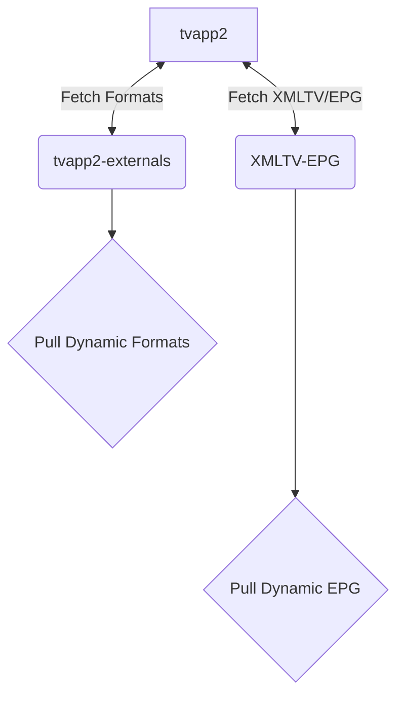

<br />

- [About](#about)
- [Building `tvapp` Image](#building-tvapp-image)
  - [Before Building](#before-building)
  - [LF over CRLF](#lf-over-crlf)
  - [Set `+x / 0755` Permissions](#set-x--0755-permissions)
  - [Build `tvapp` Image](#build-tvapp-image)
    - [Option 1: Using `docker build`](#option-1-using-docker-build)
      - [amd64](#amd64)
      - [arm64 / aarch64](#arm64--aarch64)
    - [Option 2: Using `docker buildx`](#option-2-using-docker-buildx)
      - [Option 1: Save Local Image](#option-1-save-local-image)
      - [amd64](#amd64-1)
      - [arm64 / aarch64](#arm64--aarch64-1)
      - [Option 2: Upload to Registry](#option-2-upload-to-registry)
- [Using `tvapp` Image](#using-tvapp-image)
  - [docker run](#docker-run)
  - [docker-compose.yml](#docker-composeyml)


<br />

## About

- TVApp2 makes fetch request to [tvapp2-externals](https://git.binaryninja.net/pub_projects/tvapp2-externals 'tvapp2-externals') making updates to external formats agnostic to pushing a new container image.
- TVApp2 makes fetch request to [XMLTV-EPG](https://git.binaryninja.net/pub_projects/XMLTV-EPG 'XMLTV-EPG') making updates to EPG data based on customized channel ids. Channel ids are specific to each EPG record which makes obfusctaing channel ids difficult.



<br />

---

<br />

## Building `tvapp` Image

These instructions outline how to build your own tvapp2 docker image. When building your images with the commands provided below, ensure you create two sets of tags:

| Architecture | Dockerfile           | Tags                                                                    |
| ------------ | -------------------- | ----------------------------------------------------------------------- |
| `amd64`      | `Dockerfile`         | `tvapp2:latest` <br /> `tvapp2:1.0.0` <br /> `tvapp2:1.0.0-amd64` |
| `arm64`      | `Dockerfile.aarch64` | `tvapp2:1.0.0-arm64`                                                  |

The `amd64` arch gets a few extra tags because it should be the default image people clone. 

<br />

### Before Building

Prior to building the  docker image, you **must** ensure the following conditions are met. If the below tasks are not performed, your docker container will throw the following errors when started:

- `Failed to open apk database: Permission denied`
- `s6-rc: warning: unable to start service init-adduser: command exited 127`
- `unable to exec /etc/s6-overlay/s6-rc.d/init-envfile/run: Permission denied`
- `/etc/s6-overlay/s6-rc.d/init-adduser/run: line 34: aetherxown: command not found`
- `/etc/s6-overlay/s6-rc.d/init-adduser/run: /usr/bin/aetherxown: cannot execute: required file not found`

<br />

### LF over CRLF

You cannot utilize Windows' `Carriage Return Line Feed`. All files must be converted to Unix' `Line Feed`.  This can be done with **[Visual Studio Code](https://code.visualstudio.com/)**. OR; you can run the Linux terminal command `dos2unix` to convert these files.

If you cloned the files from the official repository **[iflip721/tvapp2](https://git.binaryninja.net/pub_projects/tvapp2)** and have not edited them, then you should not need to do this step.

<br />

> [!CAUTION]
> Be careful using the command to change **ALL** files. You should **NOT** change the files in your `.git` folder, otherwise you will corrupt your git indexes.
>
> If you accidentally run dos2unix on your `.git` folder, do NOT push anything to git. Pull a new copy from the repo.

<br />

```shell
# Change ALL files
find ./ -type f | grep -Ev '.git|*.jpg|*.jpeg|*.png' | xargs dos2unix --

# Change run / binaries
find ./ -type f -name 'run' | xargs dos2unix --
```

<br />

### Set `+x / 0755` Permissions
The files contained within this repo **MUST** have `chmod 755` /  `+x` executable permissions.

```shell
find ./ -name 'run' -exec sudo chmod +x {} \;
```

<br />

**[Optional]**: If you want to set the permissions manually, run the following below. If you executed the `find` command above, you don't need to run the list of commands below:

```shell
sudo chmod +x /root/etc/s6-overlay/s6-rc.d/init-adduser/run
sudo chmod +x /root/etc/s6-overlay/s6-rc.d/init-crontab-config/run
sudo chmod +x /root/etc/s6-overlay/s6-rc.d/init-custom-files/run
sudo chmod +x /root/etc/s6-overlay/s6-rc.d/init-envfile/run
sudo chmod +x /root/etc/s6-overlay/s6-rc.d/init-folders/run
sudo chmod +x /root/etc/s6-overlay/s6-rc.d/init-keygen/run
sudo chmod +x /root/etc/s6-overlay/s6-rc.d/init-migrations/run
sudo chmod +x /root/etc/s6-overlay/s6-rc.d/init-nginx/run
sudo chmod +x /root/etc/s6-overlay/s6-rc.d/init-permissions/run
sudo chmod +x /root/etc/s6-overlay/s6-rc.d/init-php/run
sudo chmod +x /root/etc/s6-overlay/s6-rc.d/init-samples/run
sudo chmod +x /root/etc/s6-overlay/s6-rc.d/init-version-checks/run
sudo chmod +x /root/etc/s6-overlay/s6-rc.d/svc-cron/run
sudo chmod +x /root/etc/s6-overlay/s6-rc.d/svc-nginx/run
sudo chmod +x /root/etc/s6-overlay/s6-rc.d/svc-php-fpm/run
```

<br />

### Build `tvapp` Image
After completing the items above, you can now build the **[iflip721/tvapp2](https://git.binaryninja.net/pub_projects/tvapp2)** image. You can two platforms you can build your image on, pick your platform below and run the associated command. Most people will use [amd64](#amd64).

<br />

Instructions have been provided below on two different ways you can build the tvapp2 docker image. You can use either one, it depends on what tools you have available on the system you're building the image on.

- [Using docker build command](#option-1-using-docker-build)
- [Using docker buildx command](#option-2-using-docker-buildx)

<br />

#### Option 1: Using `docker build`
This method will show you how to build the TVApp2 docker image using `docker build`; this is typically what most people should use.

<br />

##### amd64

```shell ignore
# Build tvapp2 amd64
docker build --network=host --build-arg VERSION=1.0.0 --build-arg BUILD_DATE=20250224 -t tvapp2:latest -t tvapp2:1.0.0 -t tvapp2:1.0.0-amd64 -f Dockerfile .
```

<br />

##### arm64 / aarch64

```shell ignore
# Build tvapp2 arm64
docker build --network=host --build-arg VERSION=1.0.0 --build-arg BUILD_DATE=20250224 -t tvapp2:1.0.0-arm64 -f Dockerfile.aarch64 .
```

<br />
<br />

#### Option 2: Using `docker buildx`
This section explains how to build the TVApp2 docker image using `docker buildx` instead of `docker build`. It is useful when generating your app's image for multiple platforms.

<br />

All of the needed Docker files already exist in the repository. To get started, clone the repo to a folder

```shell ignore
mkdir tvapp2 && cd tvapp2
git clone https://git.binaryninja.net/pub_projects/tvapp2.git ./
```

<br />

Once the image files are downloaded, create a new container for **buildx**

```shell ignore
docker buildx create --driver docker-container --name container --bootstrap --use
```

<br />

==Optional==:  If you first need to remove the container because you created it previously, run the command:
```shell ignore
docker buildx rm container
```

<br />

You are now ready to build the TVApp2 docker image. Two different options are provided below:
- **Option 1:** [Build & Save Local Image](#option-1-save-local-image)
  - Use this option if you only wish to build the image and then use it.
- **Option 2:** [Build & Upload to Registry](#option-2-upload-to-registry)
  - Use this option if you wish to build the image and then publish it to a registry online for others to use.

<br />

##### Option 1: Save Local Image
The command below will build your TVApp2 docker image, and save a local copy of your docker app, which can be immediately used, or seen using `docker ps`.

<br />


##### amd64
```shell ignore
# Build tvapp2 amd64
docker buildx build --no-cache --pull --build-arg VERSION=1.0.0 --build-arg BUILD_DATE=20250224 -t tvapp2:latest -t tvapp2:1.0.0 --platform=linux/amd64 --output type=docker --output type=docker .
```

<br />

##### arm64 / aarch64
```shell ignore
# Build tvapp2 arm64
docker buildx build --no-cache --pull --build-arg VERSION=1.0.0 --build-arg BUILD_DATE=20250224 -t tvapp2:latest -t tvapp2:1.0.0 --platform=linux/arm64 --output type=docker --output type=docker .
```

<br />
<br />

##### Option 2: Upload to Registry
This option builds your TVApp2 docker image, and then pushes your new docker image to a registry such as hub.docker.com or Github's registry ghcr. 

Before you can push the image, ensure you are signed into Docker CLI. Open your Linux terminal and see if you are already signed in:

```shell ignore
docker info | grep Username
```

<br />

If nothing is printed; then you are not signed in. Initiate the web login:

```shell ignore
docker login
```

<br />

Some text will appear on-screen, copy the code, open your browser, and go to https://login.docker.com/activate

```console
USING WEB BASED LOGIN
To sign in with credentials on the command line, use 'docker login -u <username>'

Your one-time device confirmation code is: XXXX-XXXX
Press ENTER to open your browser or submit your device code here: https://login.docker.com/activate

Waiting for authentication in the browser…
```

<br />

Once you are finished in your browser, you can return to your Linux terminal, and it should bring you back to where you can type a command. You can now verify again if you are signed in:

```shell ignore
docker info | grep Username
```

<br />

You should see:
```console
 Username: YourUsername
```

<br />

Now you are ready to build your application's docker image, run the command:

```shell ignore
docker buildx build --no-cache --pull --build-arg VERSION=1.0.0 --build-arg BUILD_DATE=02-18-25 -t tvapp2:latest -t tvapp2:1.0.0 --platform=linux/amd64 --provenance=true --sbom=true --builder=container --push .
```

<br />

---

<br />

## Using `tvapp` Image
To use the new **[iflip721/tvapp2](https://git.binaryninja.net/pub_projects/tvapp2)** image, you can either call it with the `docker run` command, or create a new `docker-compose.yml` and specify the image:

<br />

### docker run
If you want to use the tvapp docker image in the `docker run` command, execute the following:
```shell ignore
docker run -d --restart=unless-stopped -p 443:443 --name tvapp2 -v ${PWD}/tvapp:/config ghcr.io/iflip721/tvapp2:latest
```

<br />

### docker-compose.yml
If you'd much rather use a `docker-compose.yml` file and call the tvapp image that way, create a new folder somewhere:
```shell ignore
mkdir -p /home/docker/tvapp2
```

<br />

Then create a new `docker-compose.yml` file and add the following:
```shell ignore
sudo nano /home/docker/tvapp2/docker-compose.yml
```

<br />

Add the following to your `docker-compose.yml`:

```yml ignore
services:
    tvapp:
        container_name: tvapp2
        image: ghcr.io/iflip721/tvapp2:latest       # Github image
       # image: iflip721/tvapp:latest               # Dockerhub image
        restart: unless-stopped
        volumes:
            - ./tvapp:/config
        environment:
            - PUID=1000
            - PGID=1000
            - TZ=Etc/UTC
```

<br />

Once the `docker-compose.yml` is set up, you can now start your TVApp2 container:

```shell ignore
cd /home/docker/tvapp2/
docker compose up -d
```

<br />

TVApp2 should now be running as a container. You can access it by opening your browser and going to:

```shell ignore
http://container-ip:4124
```
