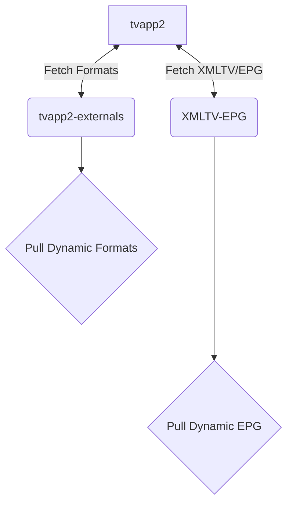

# TVApp2 Dependency Stack

- TVApp2 makes fetch request to [tvapp2-externals](https://git.binaryninja.net/pub_projects/tvapp2-externals 'tvapp2-externals') making updates to external formats agnostic to pushing a new container image.
- TVApp2 makes fetch request to [XMLTV-EPG](https://git.binaryninja.net/pub_projects/XMLTV-EPG 'XMLTV-EPG') making updates to EPG data based on customized channel ids. Channel ids are specific to each EPG record which makes obfusctaing channel ids difficult.

