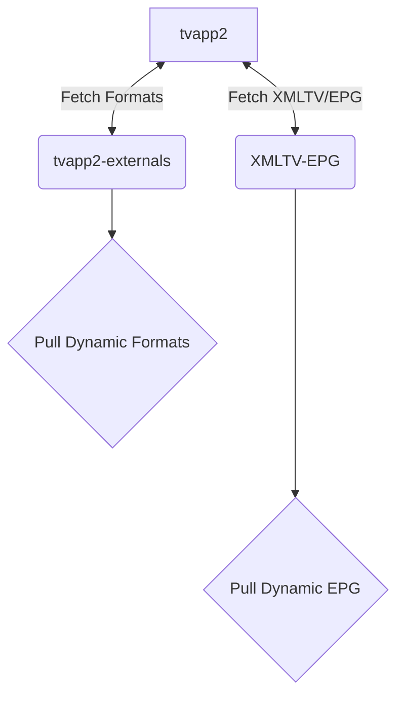
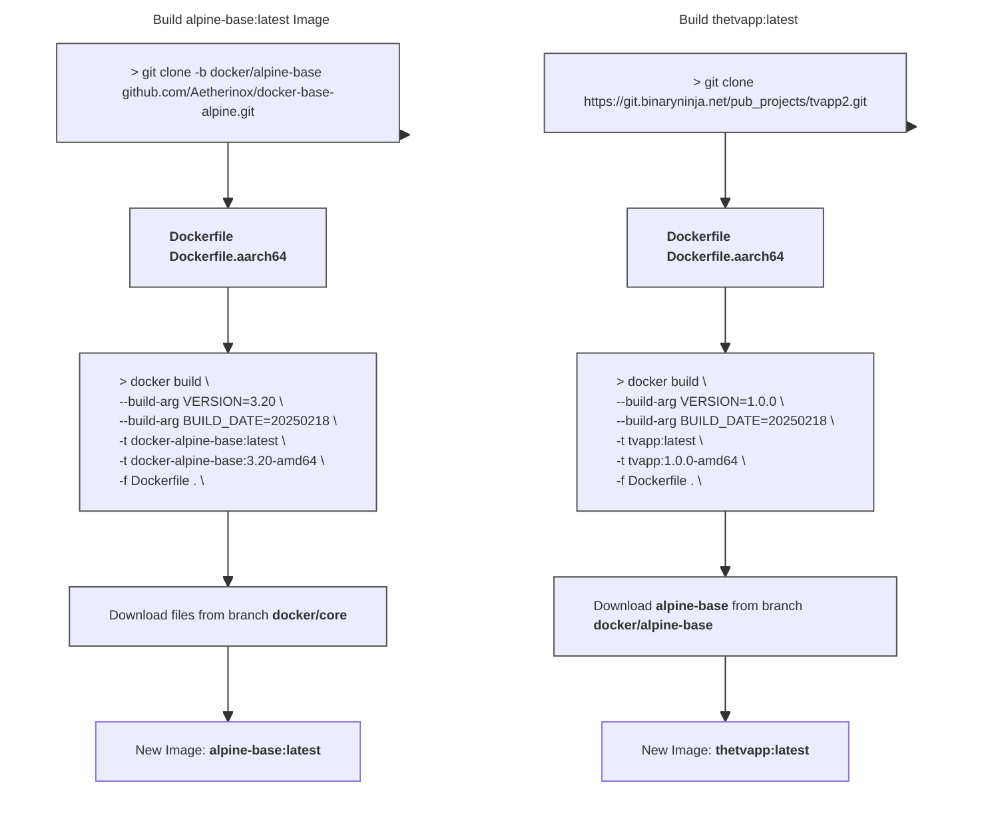

<div align="center">
<h6>A self-hosted docker container which allows you to retrieve M3U playlists and EPG guide data from numerous online IPTV services.</h6>
<h1>♾️ TVApp2 ♾️</h1>
</div>

<br />

<div align="center">

<!-- prettier-ignore-start -->
[![Version][github-version-img]][github-version-uri]
[![Downloads][github-downloads-img]][github-downloads-uri]
[![Size][github-size-img]][github-size-img]
[![Last Commit][github-commit-img]][github-commit-img]
[![Contributors][contribs-all-img]](#contributors-)
<!-- prettier-ignore-end -->

</div>

<br />

---

<br />

- [About](#about)
  - [How It Works](#how-it-works)
- [Building `tvapp` Image](#building-tvapp-image)
- [How It Works](#how-it-works-1)
  - [Before Building](#before-building)
    - [LF over CRLF](#lf-over-crlf)
    - [Set `+x / 0755` Permissions](#set-x--0755-permissions)
  - [Build `tvapp` Image](#build-tvapp-image)
    - [Option 1: Using `docker build`](#option-1-using-docker-build)
      - [amd64](#amd64)
      - [arm64 / aarch64](#arm64--aarch64)
    - [Option 2: Using `docker buildx`](#option-2-using-docker-buildx)
      - [Build \& Save Local Image](#build--save-local-image)
        - [amd64](#amd64-1)
        - [arm64 / aarch64](#arm64--aarch64-1)
      - [Build \& Upload to Registry](#build--upload-to-registry)
        - [amd64](#amd64-2)
        - [arm64 / aarch64](#arm64--aarch64-2)
    - [Option 3: Using `package.json`](#option-3-using-packagejson)
      - [Platform Commands](#platform-commands)
      - [Available Variables](#available-variables)
- [Using `tvapp` Image](#using-tvapp-image)
  - [docker run](#docker-run)
  - [docker-compose.yml](#docker-composeyml)
- [Extra Notes](#extra-notes)
  - [Custom Docker Image Scripts](#custom-docker-image-scripts)
- [🏆 Dedication](#-dedication)
- [✨ Contributors](#-contributors)

<br />

---

<br />

## About

**TVApp2** is a docker image which allows you to download M3U playlist and EPG guide data which can be plugged into your IPTV applications such as Jellyfin, Plex, and Emby. It is a revision of the original app by dtankdempse which is no longer available. This app fetches data for:

- TheTvApp
- TVPass
- MoveOnJoy
- <sub>More coming soon</sub>

<br />

This project contains several repositories which all share the same code; use them as backups:

- [https://github.com/iFlip721/tvapp2](https://github.com/iFlip721/tvapp2)
- [https://github.com/Aetherinox/tvapp2](https://github.com/Aetherinox/tvapp2)
- [https://git.binaryninja.net/pub_projects/tvapp2](https://git.binaryninja.net/pub_projects/tvapp2)

<br />

### How It Works

<br />

- TVApp2 makes fetch request to [tvapp2-externals](https://git.binaryninja.net/pub_projects/tvapp2-externals 'tvapp2-externals') making updates to external formats agnostic to pushing a new container image.
- TVApp2 makes fetch request to [XMLTV-EPG](https://git.binaryninja.net/pub_projects/XMLTV-EPG 'XMLTV-EPG') making updates to EPG data based on customized channel ids. Channel ids are specific to each EPG record which makes obfuscating channel ids difficult.

<br />



<br />

---

<br />

## Building `tvapp` Image

These instructions outline how the TVApp2 docker image is set up, and how to build your own TVApp2 docker image.

<br />

## How It Works

The TVApp2 application requires one dependency docker image, which is utilized as the base image and contains Alpine linux. You may use the pre-compiled docker image provided by us on Github, or you may choose to build your own. The base alpine image is available at:

- https://github.com/Aetherinox/docker-base-alpine

<br />

This base Alpine image contains [s6-overlay](https://github.com/just-containers/s6-overlay) and comes with several features such as plugins, service management, migration tools, etc.

<br />

The process of building both images are outlined below. But please remember that you do not need to build the base Alpine image; we already provide it at: https://github.com/Aetherinox/docker-base-alpine/pkgs/container/alpine-base

<br />



<br />

When building your TVApp2 images with the commands provided below, ensure you create two sets of tags:

| Architecture | Dockerfile           | Tags                                                                    |
| ------------ | -------------------- | ----------------------------------------------------------------------- |
| `amd64`      | `Dockerfile`         | `tvapp2:latest` <br /> `tvapp2:1.0.0` <br /> `tvapp2:1.0.0-amd64` |
| `arm64`      | `Dockerfile.aarch64` | `tvapp2:1.0.0-arm64`                                                  |

<br />

The `amd64` arch gets a few extra tags because it should be the default image people clone. 

<br />

### Before Building

Prior to building the  docker image, you **must** ensure the sections below are completed.

- [LF over CRLF](#lf-over-crlf)
- [Set +x / 0755 Permissions](#set-x--0755-permissions)

<br />

 If the listed tasks above are not performed, your docker container will throw the following errors when started:

- `Failed to open apk database: Permission denied`
- `s6-rc: warning: unable to start service init-adduser: command exited 127`
- `unable to exec /etc/s6-overlay/s6-rc.d/init-envfile/run: Permission denied`
- `/etc/s6-overlay/s6-rc.d/init-adduser/run: line 34: aetherxown: command not found`
- `/etc/s6-overlay/s6-rc.d/init-adduser/run: /usr/bin/aetherxown: cannot execute: required file not found`

<br />

#### LF over CRLF

You cannot utilize Windows' `Carriage Return Line Feed`. All files must be converted to Unix' `Line Feed`.  This can be done with **[Visual Studio Code](https://code.visualstudio.com/)**. OR; you can run the Linux terminal command `dos2unix` to convert these files.

If you cloned the files from the official repository **[iflip721/tvapp2](https://git.binaryninja.net/pub_projects/tvapp2)** and have not edited them, then you should not need to do this step.

<br />

> [!CAUTION]
> Be careful using the command to change **ALL** files. You should **NOT** change the files in your `.git` folder, otherwise you will corrupt your git indexes.
>
> If you accidentally run dos2unix on your `.git` folder, do NOT push anything to git. Pull a new copy from the repo.

<br />

```shell
# Change ALL files
find ./ -type f | grep -Ev '.git|*.jpg|*.jpeg|*.png' | xargs dos2unix --

# Change run / binaries
find ./ -type f -name 'run' | xargs dos2unix --
```

<br />

#### Set `+x / 0755` Permissions
The files contained within this repo **MUST** have `chmod 755` /  `+x` executable permissions.

```shell
find ./ -name 'run' -exec sudo chmod +x {} \;
```

<br />

**[Optional]**: If you want to set the permissions manually, run the following below. If you executed the `find` command above, you don't need to run the list of commands below:

```shell
sudo chmod +x /root/etc/s6-overlay/s6-rc.d/init-adduser/run
sudo chmod +x /root/etc/s6-overlay/s6-rc.d/init-crontab-config/run
sudo chmod +x /root/etc/s6-overlay/s6-rc.d/init-custom-files/run
sudo chmod +x /root/etc/s6-overlay/s6-rc.d/init-envfile/run
sudo chmod +x /root/etc/s6-overlay/s6-rc.d/init-folders/run
sudo chmod +x /root/etc/s6-overlay/s6-rc.d/init-keygen/run
sudo chmod +x /root/etc/s6-overlay/s6-rc.d/init-migrations/run
sudo chmod +x /root/etc/s6-overlay/s6-rc.d/init-nginx/run
sudo chmod +x /root/etc/s6-overlay/s6-rc.d/init-permissions/run
sudo chmod +x /root/etc/s6-overlay/s6-rc.d/init-php/run
sudo chmod +x /root/etc/s6-overlay/s6-rc.d/init-samples/run
sudo chmod +x /root/etc/s6-overlay/s6-rc.d/init-version-checks/run
sudo chmod +x /root/etc/s6-overlay/s6-rc.d/svc-cron/run
sudo chmod +x /root/etc/s6-overlay/s6-rc.d/svc-nginx/run
sudo chmod +x /root/etc/s6-overlay/s6-rc.d/svc-php-fpm/run
```

<br />

### Build `tvapp` Image
After completing the items above, you can now build the **[iflip721/tvapp2](https://git.binaryninja.net/pub_projects/tvapp2)** image. You can now build the TvApp2 docker image. Pick your platform below and run the associated command. Most people will want to use [amd64](#amd64).

<br />

Instructions have been provided below on two different ways you can build the TvApp2 docker image. You can use either one, it depends on what tools you have available on the system you're.

- [Using docker build commands](#option-1-using-docker-build)
- [Using docker buildx commands](#option-2-using-docker-buildx)
- [Using available node commands](#option-3-using-packagejson)

<br />

#### Option 1: Using `docker build`

This method will show you how to build the TVApp2 docker image using `docker build`; this is typically what most people should use.

<br />

##### amd64

```shell ignore
# Build tvapp2 amd64
docker build --network=host --build-arg VERSION=1.0.0 --build-arg BUILDDATE=20250224 -t tvapp2:latest -t tvapp2:1.0.0 -t tvapp2:1.0.0-amd64 -f Dockerfile .
```

<br />

##### arm64 / aarch64

```shell ignore
# Build tvapp2 arm64
docker build --network=host --build-arg VERSION=1.0.0 --build-arg BUILDDATE=20250224 -t tvapp2:1.0.0-arm64 -f Dockerfile.aarch64 .
```

<br />
<br />

#### Option 2: Using `docker buildx`

This section explains how to build the TVApp2 docker image using `docker buildx` instead of `docker build`. It is useful when generating your app's image for multiple platforms.

<br />

All of the needed Docker files already exist in the repository. To get started, clone the repo to a folder

```shell ignore
mkdir tvapp2 && cd tvapp2

# to clone from our gitea website
git clone https://git.binaryninja.net/pub_projects/tvapp2.git ./

# to clone from our github website
git clone https://github.com/iFlip721/tvapp2.git ./
```

<br />

Once the files are downloaded, create a new container for **buildx**

```shell ignore
docker buildx create --driver docker-container --name container --bootstrap --use
```

<br />

**<sup>Optional</sup>**  If you have previously created this image and have not restarted your system, clean up the original container before you build again:

```shell ignore
docker buildx rm container

docker buildx create --driver docker-container --name container --bootstrap --use
```

<br />

You are now ready to build the TVApp2 docker image. Two different options are provided below:
- **Option 1:** [Build & Save Local Image](#build--save-local-image)
  - Use this option if you only wish to build the image and use it.
- **Option 2:** [Build & Upload to Registry](#build--upload-to-registry)
  - Use this option if you wish to build the image and publish it to a registry online for others to use.

<br />

##### Build & Save Local Image
The command below will build your TVApp2 docker image, and save a local copy of your docker app, which can be immediately used, or seen using `docker ps`.

<br />


###### amd64
```shell ignore
# Build tvapp2 amd64
docker buildx build --no-cache --pull --build-arg VERSION=1.0.0 --build-arg BUILDDATE=20250224 -t tvapp2:latest -t tvapp2:1.0.0 --platform=linux/amd64 --output type=docker --output type=docker .
```

<br />

###### arm64 / aarch64
```shell ignore
# Build tvapp2 arm64
docker buildx build --no-cache --pull --build-arg VERSION=1.0.0 --build-arg BUILDDATE=20250224 -t tvapp2:latest -t tvapp2:1.0.0 --platform=linux/arm64 --output type=docker --output type=docker .
```

<br />

If we list our docker images, we should see our new one:

```
$ docker images

tvapp2        1.0.0           122e9b2c6046   1 minute ago     107MB
tvapp2        1.0.0-amd64     122e9b2c6046   1 minute ago     107MB
tvapp2        latest          122e9b2c6046   1 minute ago     107MB
```

<br />
<br />

##### Build & Upload to Registry

This option builds your TVApp2 docker image, and then pushes the new image to a registry such as hub.docker.com or Github's registry ghcr. 

Before you can push the image, ensure you are signed into Docker CLI. Open your Linux terminal and see if you are already signed in:

```shell ignore
docker info | grep Username
```

<br />

If nothing is printed; then you are not signed in. Initiate the web login:

```shell ignore
docker login
```

<br />

Some text will appear on-screen, copy the code, open your browser, and go to https://login.docker.com/activate

```console
USING WEB BASED LOGIN
To sign in with credentials on the command line, use 'docker login -u <username>'

Your one-time device confirmation code is: XXXX-XXXX
Press ENTER to open your browser or submit your device code here: https://login.docker.com/activate

Waiting for authentication in the browser…
```

<br />

Once you are finished in your browser, you can return to your Linux terminal, and it should bring you back to where you can type a command. You can now verify again if you are signed in:

```shell ignore
docker info | grep Username
```

<br />

You should see your name:
```console
 Username: Aetherinox
```

<br />

You are ready to build the TVApp2 docker image, run the command for your platform:

###### amd64

```shell ignore
docker buildx build --no-cache --pull --build-arg VERSION=1.0.0 --build-arg BUILDDATE=20250224 -t tvapp2:latest -t tvapp2:1.0.0 --platform=linux/amd64 --provenance=true --sbom=true --builder=container --push .
```

###### arm64 / aarch64

```shell ignore
docker buildx build --no-cache --pull --build-arg VERSION=1.0.0 --build-arg BUILDDATE=20250224 -t tvapp2:latest -t tvapp2:1.0.0 --platform=linux/arm64 --provenance=true --sbom=true --builder=container --push .
```

<br />
<br />

#### Option 3: Using `package.json`

This node project includes build commands. In order to use them you must install node on your machine.

```shell ignore
sudo apt-get install node
```

<br />

To build the project, `cd` into the project folder and run the build command:

```shell ignore
cd /home/docker/tvapp2/

npm run docker:build:amd64 --VERSION=1.0.1 --BUILDDATE=20250220
```

<br />

##### Platform Commands

The following is a list of the available commands you can pick from depending on how you would like to build TvAPP2:

| Command | Description |
| --- | --- |
| `docker:build:amd64` | Build image using `docker build` for `amd64` |
| `docker:build:arm64` | Build image using `docker build` for `arm64 / aarch64` |
| `docker:buildx:amd64` | Build image using `docker buildx` for `amd64` |
| `docker:buildx:arm64` | Build image using `docker buildx` for `arm64 / aarch64` |

<br />

##### Available Variables
The run command above has several variables you must specify:

| Variable | Description |
| --- | --- |
| `--VERSION=1.X.X` | The version to assign to the docker image |
| `--BUILDDATE=20250220` | The date to assign to the docker image. <br /> Date format: `YEAR / MONTH / DAY` |


<br />

---

<br />

## Using `tvapp` Image
To use the new TVApp2 image, you can either call it with the `docker run` command, or create a new `docker-compose.yml` and specify the image:

<br />

### docker run
If you want to use the tvapp docker image in the `docker run` command, execute the following:
```shell ignore
docker run -d --restart=unless-stopped -p 4124:4124 --name tvapp2 -v ${PWD}/tvapp:/config ghcr.io/iflip721/tvapp2:latest
```

<br />

### docker-compose.yml
If you'd much rather use a `docker-compose.yml` file and call the tvapp image that way, create a new folder somewhere:
```shell ignore
mkdir -p /home/docker/tvapp2
```

<br />

Then create a new `docker-compose.yml` file and add the following:
```shell ignore
sudo nano /home/docker/tvapp2/docker-compose.yml
```

<br />

Add the following to your `docker-compose.yml`:

```yml ignore
services:
    tvapp:
        container_name: tvapp2
        image: ghcr.io/iflip721/tvapp2:latest       # Github image
      # image: iflip721/tvapp:latest                # Dockerhub image
        restart: unless-stopped
        volumes:
            - ./tvapp:/config
        environment:
            - PUID=1000
            - PGID=1000
            - TZ=Etc/UTC
```

<br />

Once the `docker-compose.yml` is set up, you can now start your TVApp2 container:

```shell ignore
cd /home/docker/tvapp2/
docker compose up -d
```

<br />

TVApp2 should now be running as a container. You can access it by opening your browser and going to:

```shell ignore
http://container-ip:4124
```

<br />

---

<br />

## Extra Notes

The following are other things to take into consideration when creating the TVApp2 image:

<br />

### Custom Docker Image Scripts

These instructions are for **Advanced Users Only**

The `🔀 iflip721/tvapp2` image supports the ability of adding custom scripts that will be ran when the container is started. To create / add a new custom script to the container, you need to create a new folder in the container source files `/root` folder

```shell
mkdir -p /root/custom-cont-init.d/
```

<br />

Within this new folder, add your custom script:

```shell
nano /root/custom-cont-init.d/my_customs_script
```

<br />

Your new custom script should be populated with the bash code you want to perform actions with such as the example below:

```bash
#!/bin/bash

echo "**** INSTALLING BASH ****"
apk add --no-cache bash
```

<br />

When you create the docker image, this new script will automatically be loaded. You can also do this via the `📄 docker-compose.yml` file by mounting a new volume:

```yml
services:
    tvapp2:
        volumes:
            - ./tvapp2:/config
            - ./custom-scripts:/custom-cont-init.d:ro
```

<br />

> [!NOTE]
> if using compose, we recommend mounting them **read-only** (`:ro`) so that container processes cannot write to the location.

> [!WARNING]
> The folder `📂 /root/custom-cont-init.d` **MUST** be owned by `root`. If this is not the case, this folder will be renamed and a new empty folder will be created. This is to prevent remote code execution by putting scripts in the aforesaid folder.

<br />

The `🔀 iflip721/tvapp2` image already contains a custom script called `📄 /root/custom-cont-init.d/plugins`. Do **NOT** edit this script. It is what automatically downloads the official TVApp2 plugins and adds them to the container.

<br />

---

<br />

## 🏆 Dedication

This repository and this project serves in memory of the developer [dtankdempse](https://hub.docker.com/r/dtankdemp). His work lives on in this project, and while a lot of it has changed, it all started because of him.

<br />

<div align="center">
    <table>
        <tbody>
            <tr>
                <td align="center" valign="top"><a href="https://github.com/dtankdempse">
                    <br /><sub><b>dtankdempse</b></sub></a><br /><a href="https://github.com/iFlip721/tvapp2/commits?author=dtankdempse" title="Code">💻</a>
                </td>
            </tr>
        </tbody>
    </table>
</div>

<br />

---

<br />

## ✨ Contributors
We are always looking for contributors. If you feel that you can provide something useful to Gistr, then we'd love to review your suggestion. Before submitting your contribution, please review the following resources:

- [Pull Request Procedure](.github/PULL_REQUEST_TEMPLATE.md)
- [Contributor Policy](CONTRIBUTING.md)

<br />

Want to help but can't write code?
- Review [active questions by our community](https://github.com/iFlip721/tvapp2/labels/help%20wanted) and answer the ones you know.

<br />


<br />

The following people have helped get this project going:

<br />

<div align="center">

<!-- ALL-CONTRIBUTORS-BADGE:START - Do not remove or modify this section -->
[![Contributors][contribs-all-img]](#contributors-)
<!-- ALL-CONTRIBUTORS-BADGE:END -->

<!-- ALL-CONTRIBUTORS-LIST:START - Do not remove or modify this section -->
<!-- prettier-ignore-start -->
<!-- markdownlint-disable -->
<table>
    <tbody>
        <tr>
            <td align="center" valign="top"><a href="https://github.com/Aetherinox">
                <br /><sub><b>Aetherinox</b></sub></a><br /><a href="https://github.com/iFlip721/tvapp2/commits?author=Aetherinox" title="Code">💻</a>
            </td>
            <td align="center" valign="top"><a href="https://github.com/iFlip721">
                <br /><sub><b>iFlip721</b></sub></a><br /><a href="https://github.com/iFlip721/tvapp2/commits?author=iFlip721" title="Code">💻</a>
            </td>
            <td align="center" valign="top"><a href="https://github.com/Nvmdfth">
                <br /><sub><b>Optx</b></sub></a><br /><a href="https://github.com/iFlip721/tvapp2/commits?author=Nvmdfth" title="Code">💻</a>
            </td>
        </tr>
    </tbody>
</table>
</div>
<!-- markdownlint-restore -->
<!-- prettier-ignore-end -->
<!-- ALL-CONTRIBUTORS-LIST:END -->

<br />
<br />

<!-- BADGE > GENERAL -->
  [general-npmjs-uri]: https://npmjs.com
  [general-nodejs-uri]: https://nodejs.org
  [general-npmtrends-uri]: http://npmtrends.com/csf-firewall

<!-- BADGE > VERSION > GITHUB -->
  [github-version-img]: https://img.shields.io/github/v/tag/iFlip721/tvapp2?logo=GitHub&label=Version&color=ba5225
  [github-version-uri]: https://github.com/iFlip721/tvapp2/releases

<!-- BADGE > LICENSE > MIT -->
  [license-mit-img]: https://img.shields.io/badge/MIT-FFF?logo=creativecommons&logoColor=FFFFFF&label=License&color=9d29a0
  [license-mit-uri]: https://github.com/iFlip721/tvapp2/blob/main/LICENSE

<!-- BADGE > GITHUB > DOWNLOAD COUNT -->
  [github-downloads-img]: https://img.shields.io/github/downloads/iFlip721/tvapp2/total?logo=github&logoColor=FFFFFF&label=Downloads&color=376892
  [github-downloads-uri]: https://github.com/iFlip721/tvapp2/releases

<!-- BADGE > GITHUB > DOWNLOAD SIZE -->
  [github-size-img]: https://img.shields.io/github/repo-size/iFlip721/tvapp2?logo=github&label=Size&color=59702a
  [github-size-uri]: https://github.com/iFlip721/tvapp2/releases

<!-- BADGE > ALL CONTRIBUTORS -->
  [contribs-all-img]: https://img.shields.io/github/all-contributors/iFlip721/tvapp2?logo=contributorcovenant&color=de1f6f&label=contributors
  [contribs-all-uri]: https://github.com/all-contributors/all-contributors

<!-- BADGE > GITHUB > BUILD > NPM -->
  [github-build-img]: https://img.shields.io/github/actions/workflow/status/iFlip721/tvapp2/npm-release.yml?logo=github&logoColor=FFFFFF&label=Build&color=%23278b30
  [github-build-uri]: https://github.com/iFlip721/tvapp2/actions/workflows/npm-release.yml

<!-- BADGE > GITHUB > BUILD > Pypi -->
  [github-build-pypi-img]: https://img.shields.io/github/actions/workflow/status/iFlip721/tvapp2/release-pypi.yml?logo=github&logoColor=FFFFFF&label=Build&color=%23278b30
  [github-build-pypi-uri]: https://github.com/iFlip721/tvapp2/actions/workflows/pypi-release.yml

<!-- BADGE > GITHUB > TESTS -->
  [github-tests-img]: https://img.shields.io/github/actions/workflow/status/iFlip721/tvapp2/npm-tests.yml?logo=github&label=Tests&color=2c6488
  [github-tests-uri]: https://github.com/iFlip721/tvapp2/actions/workflows/npm-tests.yml

<!-- BADGE > GITHUB > COMMIT -->
  [github-commit-img]: https://img.shields.io/github/last-commit/iFlip721/tvapp2?logo=conventionalcommits&logoColor=FFFFFF&label=Last%20Commit&color=313131
  [github-commit-uri]: https://github.com/iFlip721/tvapp2/commits/main/
